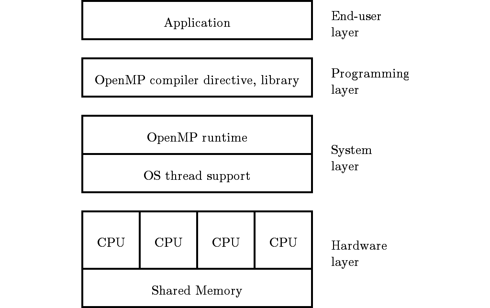
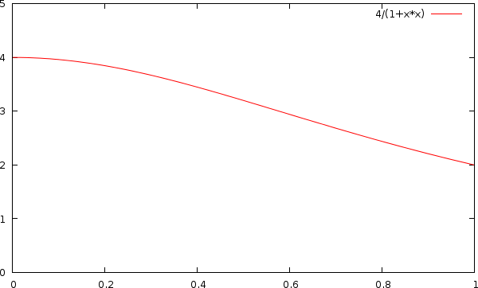
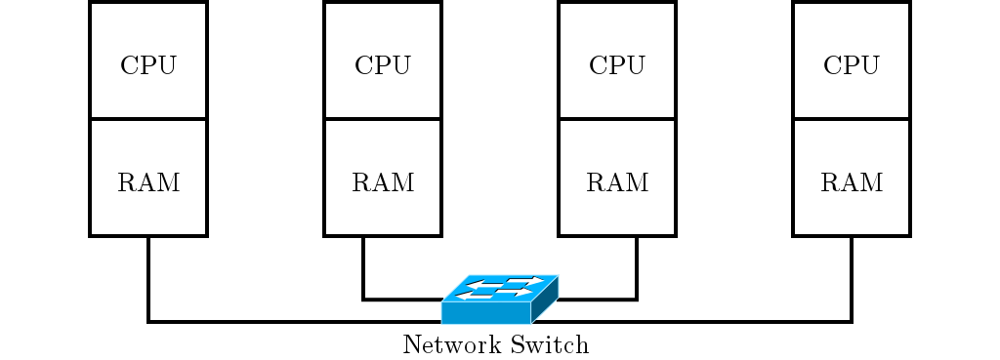

# Pemrosesan Paralel

Berdasarkan memori, komputer paralel dapat dibagi menjadi:

- *shared memory*: multi prosesor berbagi pakai satu memori.
- *distributed memory*: multi prosesor masing-masing punya memori sendiri yang dihubungkan oleh jaringan (*cluster*).

## Multiprocessing

Memakai `fork` untuk menduplikasi proses menjadi dua.
Komunikasi antar proses sulit dilakukan karena fungsi yang tersedia terbatas.

~~~c
#include <stdio.h>
#include <unistd.h>

int main()
{
    // duplikasi proses menjadi 4 proses
    fork();
    fork();

    printf("Hello!\n");

    return 0;
}
~~~

## Multithreading

Memakai library `pthread` (POSIX _threading interface_) untuk membuat dan sinkronisasi beberapa _thread_ dalam satu proses.
POSIX adalah antarmuka standar untuk sistem operasi UNIX.
Tidak ada dukungan komunikasi secara eksplisit karena data di-_share_ antar _thread_, yaitu variabel global dan alokasi memori pada _heap_.
Kompilasi program dengan `gcc -lpthread`.

~~~c
#include <pthread.h>
#include <stdio.h>

void *say_hello(void *arg)
{
    printf("Hello!\n");
    pthread_exit(NULL);
}

int main()
{
    pthread_t T[4];
    int i;

    // membuat 4 thread yg menjalankan fungsi say_hello
    for (i = 0; i < 4; i++)
        pthread_create(&T[i], NULL, say_hello, NULL);

    for (i = 0; i < 4; i++)
        pthread_join(T[i], NULL);

    return 0;
}
~~~

## OpenMP

OpenMP adalah standar yang digunakan untuk pemrograman paralel *multithreading* pada arsitektur *shared memory*.
Sudah termasuk pada *compiler* GCC, sehingga tidak perlu instalasi tambahan.
Programmer cukup menambahkan direktif `omp` pada `#pragma` untuk memparalelkan program.
Kompilasi program menggunakan `gcc -fopenmp`.

~~~c
#include <omp.h>
#include <stdio.h>

int main()
{
    #pragma omp parallel num_threads(4)
    printf("Hello!\n");

    return 0;
}
~~~

## OpenMPI

_Message passing interface_ (MPI) adalah standar yang digunakan untuk pemrograman paralel pada _distributed memory_ (_cluster_).
Program MPI akan berjalan secara _multiprocessing_, tiap proses memiliki memori tersendiri.
Instalasi OpenMPI pada Debian/Ubuntu Linux dilakukan dengan menginstal paket `mpi-default-bin` dan `mpi-default-dev`.
Kompilasi dan eksekusi program menggunakan `mpicc` dan `mpiexec -n <#> <program>`.

~~~c
#include <mpi.h>
#include <stdio.h>

int main()
{
    MPI_Init(NULL, NULL);

    printf("Hello!\n");

    MPI_Finalize();
    return 0;
}
~~~

# OpenMP

OpenMP adalah API untuk menulis aplikasi *multithreaded* (MT),
berupa satu set direktif *compiler* dan *library* untuk pemrograman aplikasi paralel
yang menyederhanakan penulisan program MT pada C, C++, dan Fortran.
OpenMP dirancang untuk berjalan pada komputer *shared memory* (Gambar \ref{sharedmem}) yang menyediakan fitur *threading*.
Secara umum, banyak dipakai untuk sistem SMP dan CPU *multi-core*.

\newpage

## Sintaks Dasar OpenMP

Hampir semua *construct* pada OpenMP adalah direktif *compiler*.

~~~c
#pragma omp construct [clause [clause] ...]
~~~

Contoh:

~~~c
#pragma omp parallel num_threads(4)
~~~

Prototipe fungsi dan tipe data terdapat pada berkas

~~~c
#include <omp.h>
~~~

Sebagian besar *construct* OpenMP berlaku untuk satu blok terstruktur.
Blok terstruktur adalah blok yang terdiri atas satu atau lebih pernyataan dengan satu titik masuk di atas dan satu titik keluar di bawah.

\newpage

## Paralelisasi

`parallel`

:   Direktif untuk membuat *thread* sebanyak klausa `num_threads(#)` dan memulai wilayah paralel; terdapat *implicit barrier* pada akhir direktif. Jika klausa `num_threads` tidak ada, jumlah *thread* yang dibuat adalah *default*, sesuai dengan jumlah *core* prosesor.

`... num_threads(n)`
:   Klausa untuk menentukan jumlah *thread* yang akan dibuat dalam wilayah paralel sebanyak `n`.

`... private(var)`

:   Klausa untuk membuat variabel `var` menjadi privat, tiap *thread* memiliki salinan variabel ini.

`... shared(var)`

:   Klausa untuk membuat variabel `var` menjadi publik, semua *thread* dapat mengubah variabel ini (perhatikan *race condition*).

`omp_get_thread_num()`

:   Fungsi untuk mendapatkan nomor dari tiap *thread* yang sedang berjalan.

`omp_get_num_threads()`

:   Fungsi untuk mendapatkan jumlah *thread* yang sedang berjalan.

Berikut adalah contoh penggunaan direktif OpenMP untuk memparalelkan baris yang mencetak *string* "Hello world!" dengan 8 *thread*.

~~~c
#include <stdio.h>

int main()
{
    #pragma omp parallel num_threads(8)
    printf("Hello world!\n");

    return 0;
}
~~~

\newpage

### Latihan 1: Hello world

Paralelkan program berikut, cetak nomor identitas setiap *thread*!

~~~c
#include <stdio.h>

int main()
{
    int id = 0;
    printf("thread id = %d\n", id);

    return 0;
}
~~~

<!--

**Solusi**

- Tambahkan berkas *header* `omp.h`.
- Tambahkan direktif `parallel` pada kode yang akan diparalelkan.
- Gunakan fungsi `omp_get_thread_num()` untuk mendapatkan nomor *thread*.

~~~c
#include <omp.h>
#include <stdio.h>

int main()
{
    #pragma omp parallel
    {                                   // awal wilayah paralel
        int id = omp_get_thread_num();  // mendapatkan nomor thread
        printf("Hello world!(%d)", id);
    }                                   // akhir wilayah paralel

    return 0;
}
~~~

-->

\newpage

## Sinkronisasi

`critical`

:   Direktif untuk membuat wilayah kritis dalam wilayah paralel, hanya satu *thread* dalam satu waktu yang bisa masuk ke wilayah kritis ini. Wilayah kritis perlu dibuat untuk melindungi *shared variable* dari *race condition* yang mengakibatkan inkonsistensi data.

`atomic`

:   Direktif yang fungsinya sama seperti `critical`, tetapi hanya berlaku untuk satu *statement* aritmatika saja.

`barrier`

:   Direktif untuk membuat batas, *thread* akan menunggu sampai semua *thread* sampai pada batas ini.

Contoh program untuk mencacah sampai 1200. Keluaran yang benar adalah 1200. Namun, keluaran menjadi tidak konsisten jika dijalankan oleh lebih dari satu *thread*. Oleh karena itu, wilayah kritis perlu diidentifikasi dan dilindungi dengan direktif `critical`. Tambahkan direktif ini sebelum memodifikasi *shared variable*.

~~~c
#include <stdio.h>

#define N 1200
#define T 4

int main() {

    int sum = 0;

    #pragma omp parallel num_threads(T)
    {
        int i;
        for (i = 0; i < N/T; i++)
            sum++;                  // critical section
    }

    printf("%d\n", sum);

    return 0;
}

~~~

\newpage

### Latihan 2: Jumlah nilai elemen *array*

Paralelkan program untuk menghitung jumlah elemen *array* di bawah ini dengan 4 *thread*!
Pembagian kerja tiap *thread* harus seimbang dan nilai keluaran harus konsisten (hindari *race condition*).

~~~c
#include <omp.h>
#include <stdio.h>

#define N 16

int main()
{
    int A[N] = {1,2,3,4,5,6,7,8,9,10,11,12,13,14,15,16};
    int i, sum = 0;

    for (i = 0; i < N; i++)
        sum += A[i];

    printf("%d\n", sum);

    return 0;
}
~~~

<!--

**Solusi**

- Tambahkan direktif `parallel` dengan `num_threads` 4.
- Variabel `i` harus dijadikan *private*, pindahkan deklarasinya ke wilayah paralel.
- Pembagian kerja
    - dapakan nomor masing-masing *thread*.
    - hitung indeks awal dan akhir data yang akan diproses oleh tiap *thread* sesuai dengan nomornya.
- Simpan hasil penjumlahan ke variabel lokal dahulu, yaitu `sumlokal`.
- Tambahkan `sumlokal` ke variabel global `sum` dengan menggunakan direktif `critical` atau `atomic` untuk menghindari *race condition*.

~~~c
#include <omp.h>
#include <stdio.h>

#define N 16
#define T 4

int main()
{
    int A[N] = {1,2,3,4,5,6,7,8,9,10,11,12,13,14,15,16};
    int sum = 0;

    #pragma omp parallel num_threads(T)
    {
        int i, id, start, stop, sumlokal = 0;

        id = omp_get_thread_num();
        start = id * N/T;
        stop  = (id+1) * N/T;
        for (i = start; i < stop; i++)
            sumlokal += A[i];

        #pragma omp critical
        sum += sumlokal;
    }

    printf("%d\n", sum);

    return 0;
}
~~~

-->

\newpage

## *Worksharing* dan Reduksi

Tiap *thread* mengerjakan tugas yang sama tetapi datanya berbeda, *single instruction multiple data* (SIMD).
Suatu *looping* dapat diparalelkan dengan membagi-bagi data ke tiap *thread*.

`for`

:   Direktif untuk membagi pekerjaan suatu *looping* ke tiap *thread* (paralelisme data); terdapat *implicit barrier* pada akhir direktif.

`... schedule(type, chunk)`

:   Klausa untuk mengatur metode pembagian *looping* dengan `type`: `static`, `dynamic`, dan `guided`. *Default*-nya adalah `static` dengan besar `chunk` = jumlah iterasi / jumlah *thread*.

`... reduction(op:var)`

:   Klausa untuk mereduksi hasil dari tiap *thread* ke variabel skalar `var` dengan operator `op`: `+`, `*`, `-`, `&`, `^`, `|`, `&&`, `||`, `min`, dan `max`.

`... nowait`

:   Klausa agar *thread* jika telah selesai dari konstruk `for` tidak perlu menunggu *thread* lain selesai.

### Contoh direktif `for`

~~~c
#include <omp.h>
#include <stdio.h>

int main()
{
    int i, id;

    #pragma omp parallel private(id)
    {
        id = omp_get_thread_num();

        #pragma omp for
        for (i = 0; i < 16; i++)
            printf("Thread-%d: index-%d\n", id, i);
    }

    return 0;
}
~~~

Contoh direktif `for` di atas tidak menggunakan klausa `schedule`, sehingga `schedule` *default*-nya adalah `static` dengan *chunk* sebesar $16 / 4 = 4$.
Variabel untuk *counter*---pada contoh di atas variabel `i`---otomatis akan bersifat *private*.
Ilustrasi pembagian data dapat dilihat pada Gambar \ref{static}.

### Contoh klausa `schedule`

Tambahkan klausa `schedule` di belakang direktif `for` untuk menentukan skema pembagian data.
Pada *schedule* `dynamic` pembagian data berubah secara dinamis sesuai dengan kondisi saat *runtime*.
*Thread* mendapat pekerjaan sejumlah *chunk*,  jika sudah selesai *thread* tersebut meminta lagi pekerjaan sejumlah *chunk*, seterusnya sampai pekerjaan selesai.
Sedangkan pada *schedule* `guided`, pembagian data sama seperti `dynamic` tetapi jumlah *chunk* ditentukan secara otomatis oleh OpenMP.
Berikut adalah beberapa contoh penggunaan klausa `schedule`.

- *Schedule* `static` dengan *chunk* 1 (*lihat* Gambar \ref{static1}).

~~~c
        #pragma omp for schedule(static,1)
        for (i = 0; i < 16; i++)
            printf("Thread-%d: index-%d\n", id, i);
~~~

- *Schedule* `static` dengan *chunk* 2 (*lihat* Gambar \ref{static2}).

~~~c
        #pragma omp for schedule(static,2)
        for (i = 0; i < 16; i++)
            printf("Thread-%d: index-%d\n", id, i);
~~~

<!--
- *Schedule* `dynamic` dengan *chunk* 2 (*lihat* Gambar \ref{dynamic2}).

~~~c
        #pragma omp for schedule(dynamic,2)
        for (i = 0; i < 16; i++)
            printf("Thread-%d: index-%d\n", id, i);
~~~

- *Schedule* `guided` (*lihat* Gambar \ref{guided}).

~~~c
        #pragma omp for schedule(guided)
        for (i = 0; i < 16; i++)
            printf("Thread-%d: index-%d\n", id, i);
~~~
-->

<!--

-->

### Contoh klausa `reduction`

~~~c
#include <omp.h>
#include <stdio.h>

int main()
{
    int total = 0;

    #pragma omp parallel reduction(+:total)
    total = 1;

    printf("%d\n", total);

    return 0;
}
~~~

\newpage

### Latihan 3: Jumlah nilai elemen *array*

Sederhanakan solusi [Latihan 2](#latihan-2-jumlah-nilai-elemen-array) dengan menggunakan direktif `for` dan `reduction`!

~~~c
#include <stdio.h>

#define N 16

int main()
{
    int A[N] = {1,2,3,4,5,6,7,8,9,10,11,12,13,14,15,16};
    int i, sum = 0;

    ...
    {
        ...
        for (i = 0; i < N; i++)
            sum += A[i];
    }

    printf("%d\n", sum);
    return 0;
}
~~~

\newpage

### Latihan 4: Mencari nilai maksimum

Paralelkan program untuk mencari nilai maksimum dari suatu *list* $A$ berikut ini!

~~~c
#include <stdio.h>
#include <limits.h>

#define N 16

int main()
{
    int A[N] = {45,16,68,69,1,90,0,29,88,42,0,72,0,40,24,21};
    int i, maks = INT_MIN;

    for (i = 0; i < N; i++)
        if (A[i] > maks)
            maks = A[i];

    printf("%d\n", maks);
    return 0;
}
~~~

\newpage

### Latihan 5: Menghitung nilai $\pi$

Paralelkan program untuk menghitung nilai $\pi$ dengan pendekatan integrasi *mid-point* berikut ini!

$$\pi = \int_0^1 \! \frac{4}{1 + x^2} \, \mathrm{d}x$$

~~~c
#include <stdio.h>
#include <stdlib.h>
#include <math.h>
#include <omp.h>

int main(int argc, char* argv[])
{
    int a, b;
    long long int i, n;
    long double x, y, dx, area;

    n = atoll(argv[1]);                 // jumlah rectangle
    a = 0;                              // batas bawah
    b = 1;                              // batas atas
    dx = (double) (b-a) / n;            // lebar rectangle
    area = 0.0;

    double time = omp_get_wtime();

    for (i = 0; i < n; i++) {
        x = a + (i + 0.5) * dx;             // midpoint
        y = (4.0 / (1.0 + x*x));            // f(x) = 4 / (1+x^2)
        area += y * dx;
    }

    time = omp_get_wtime() - time;

    printf("   Pi: %.16Lf\n", area);
    printf("Error: %.16Lf\n", area - M_PI);
    printf("%lf\n", time);
    return 0;
}
~~~

\newpage

### Latihan 6: Perkalian matriks-vektor

Paralelkan program perkalian matriks dengan vektor berikut!

~~~c
#include <stdio.h>
#define M 4     // row
#define N 4     // column

int main()
{
    int A[M][N] = {{2, 1, 0, 4},
                   {3, 2, 1, 1},
                   {4, 3, 1, 2},
                   {3, 0, 2, 0}};
    int b[N] = {1, 3, 4, 1};
    int c[M] = {};
    int i, j;

    // c = A*b
    for (i = 0; i < M; i++)
        for (j = 0; j < N; j++)
            c[i] += A[i][j] * b[j];

    // print c
    for (i = 0; i < M; i++)
        printf("%d\n", c[i]);

    return 0;
}
~~~

\newpage

## Paralelisasi Fungsional

Tiap *thread* mengerjakan tugas yang berbeda, *multiple instruction multiple data* (MIMD).

`sections`

:   Direktif untuk membagi-bagi beberapa pekerjaan yang berbeda; terdapat *implicit barrier* pada akhir direktif.

`section`

:   Direktif untuk mendefinisikan satu bagian dari `sections` yang akan dikerjakan oleh satu *thread*.

~~~c
#include <stdio.h>

int main()
{
    #pragma omp parallel
    {
        #pragma omp sections
        {
            #pragma omp section
            printf("Task A\n");

            #pragma omp section
            printf("Task B\n");

            #pragma omp section
            printf("Task C\n");
        }
    }

    return 0;
}
~~~

Direktif `parallel` dan `sections` di atas dapat digabungkan menjadi satu menjadi berikut ini.

~~~c
    #pragma omp parallel sections
    {
        #pragma omp section
        // ...
    }
~~~

\newpage

## Eksekusi *Thread* Tunggal

`single`

:   Direktif untuk mendefinisikan satu blok terstruktur yang akan dijalankan oleh tepat satu *thread* (*arbitrary*);
    terdapat *implicit barrier* pada akhir direktif.

`master`

:   Direktif ini sama seperti `single`, tetapi yang berjalan adalah khusus *thread* *master* saja (*thread* 0) dan tidak ada *implicit barrier* pada akhir direktif.

~~~c
#include <stdio.h>
#include <omp.h>

int main()
{
    #pragma omp parallel
    {
        int id = omp_get_thread_num();

        #pragma omp single
        printf("[%d]Hello ", id);

        printf("[%d]world\n", id);
    }

    return 0;
}
~~~

\newpage

## Pengukuran Kinerja Program Paralel

Pengukuran kinerja dilakukan dengan membandingkan waktu eksekusi antara program sekuensial dengan program paralel.
Penghitungan waktu dilakukan dengan memakai fungsi `omp_get_wtime()`.
Jumlah iterasi dibuat bervariasi untuk melihat pengaruhnya terhadap kinerja program paralel.

Setelah didapatkan waktu eksekusinya, dihitung *speedup* dan efisiensi program paralel.
*Speedup* adalah berapa kali lebih cepat waktu eksekusi program paralel ($T_P$) dibandingkan dengan program biasa ($T_S$).
Efisiensi adalah ukuran seberapa besar waktu prosesor dipakai dengan baik, dihitung sebagai *speedup* ($S$) dibagi dengan jumlah prosesor ($p$).
Efisiensi ideal adalah 100%, tetapi pada praktiknya antara 0--100%.

$$S = \frac{T_S}{T_P}$$

$$E = \frac{S}{p}$$

Berikut adalah contoh *shell script* yang digunakan untuk mengotomatisasi pengukuran kinerja program menghitung $\pi$ pada [Latihan 5](#latihan-5-menghitung-nilai-pi).

~~~bash
#!/bin/bash

for n in 10 100 1000 10000 100000 1000000 10000000 100000000; do
    ./pi $n | tail -1
done
~~~

Hasil pengukuran yang dilakukan pada prosesor Intel Core i3-2330M dengan ($p = 4$) disajikan dalam Tabel \ref{speedup-pi} berikut ini.
Pada jumlah iterasi yang sedikit ($< 10^5$), kinerja program paralel lebih buruk daripada program biasa.
Hal ini disebabkan karena *overhead* yang tinggi, yaitu proporsi waktu untuk membuat *thread* lebih besar daripada komputasi aktual.
Seiring bertambahnya jumlah iterasi, *overhead* semakin kecil proporsinya.
Kinerja terbaik adalah *speedup* 2.6 kali lipat dan efisiensi 66% pada jumlah iterasi $10^7$.

Iterasi     T sekuensial     T paralel     *Speedup*   Efisiensi
--------   --------------   -----------   ----------- -----------
$10^1$      0.000           0.002           0.00        0%
$10^2$      0.000           0.002           0.02        0%
$10^3$      0.000           0.002           0.13        3%
$10^4$      0.002           0.003           0.81        20%
$10^5$      0.020           0.017           1.19        30%
$10^6$      0.197           0.110           1.80        45%
$10^7$      2.473           0.942           2.63        66%
$10^8$      20.387          9.639           2.11        53%

Table: Kinerja program paralel menghitung $\pi$\label{speedup-pi}.

<!--
# Pemrosesan Citra dengan OpenMP

http://en.wikipedia.org/wiki/Netpbm_format
-->

# MPI

MPI adalah standar untuk menulis aplikasi paralel pada arsitektur *distributed memory* (Gambar \ref{distmem}).
MPI mendukung bahasa pemrograman C, C++, dan Fortran.
MPI dirancang untuk berjalan pada komputer *cluster* yang terhubung melalui jaringan.
Salah satu implementasi MPI adalah OpenMPI.

Semua fungsi dan konstanta pada MPI memiliki prefiks `MPI`.
Prototipe fungsi dan tipe data terdapat pada header `mpi.h`
Kompilasi dan eksekusi program MPI menggunakan `mpicc` dan `mpiexec`.

\newpage

## Inisialisasi

`MPI_Init(*argc, *argv)`

:   Fungsi untuk menginisialisasi lingkungan eksekusi MPI.

`MPI_Finalize()`

:   Fungsi untuk mengakhiri lingkungan eksekusi MPI.

`MPI_Comm_size(comm, *size)`

:   Fungsi untuk mendapatkan jumlah prosesor yang terlibat dalam satu komunikator.

`MPI_Comm_rank(comm, *rank)`

:   Fungsi untuk mendapatkan rank/ID prosesor yang terlibat dalam satu komunikator.

`MPI_COMM_WORLD`

:   Komunikator (grup komunikasi) yang mencakup semua proses.

### Contoh inisialisasi MPI

Berikut contoh kode program `hello.c`.

~~~c
#include <mpi.h>
#include <stdio.h>

int main(int argc, char **argv)
{
    int size, id;

    MPI_Init(&argc, &argv);
    MPI_Comm_size(MPI_COMM_WORLD, &size);
    MPI_Comm_rank(MPI_COMM_WORLD, &id);

    printf("Hello from process %d-of-%d\n", id, size);

    MPI_Finalize();
    return 0;
}
~~~

Berikut cara kompilasi dan menjalankan program `hello` dengan 4 prosesor.

~~~bash
$ mpicc hello.c -o hello
$ mpiexec -n 4 hello
~~~

### Latihan 1: Hello world

Ubah program yang mencetak `Hello world!(id)` berikut ini supaya menjadi paralel.
Jalankan dengan 4 proses, namun proses ke-0 tidak mencetak apapun.

~~~c
#include <stdio.h>

int main()
{
    int id = 0;
    printf("Hello world!(%d)\n", id);

    return 0;
}
~~~

<!--

**Solusi**

~~~c
#include <mpi.h>
#include <stdio.h>

int main()
{
    int id;

    MPI_Init(NULL, NULL);
    MPI_Comm_rank(MPI_COMM_WORLD, &id);

    if (id != 0)
        printf("Hello world!(%d)\n", id);

    MPI_Finalize();
    return 0;
}
~~~

-->

\newpage

## Komunikasi *Point to Point*

Komunikasi *point-to-point* mengirimkan pesan dari satu proses pengirim (`source`) ke satu proses penerima (`dest`).
Tiap `send` harus ada `recv` yang bersesuaian, jika tidak dapat terjadi *deadlock*.
Parameter `tag` digunakan untuk membedakan pesan yang dikirim oleh `source` dan `dest` yang sama.

`MPI_Send(*buffer, count, datatype, dest, tag, comm)`

:   Fungsi untuk mengirim pesan ke proses `dest` (*blocking*).

`MPI_Recv(*buffer, count, datatype, source, tag, comm, *status)`

:   Fungsi untuk menerima pesan dari proses `source` (*blocking*).

`MPI_CHAR, MPI_INT, MPI_LONG, MPI_FLOAT, MPI_DOUBLE, MPI_BYTE, ...`

:   Konstanta tipe data untuk pengiriman pesan.

~~~c
#include <mpi.h>
#include <stdio.h>

int main()
{
    int id, x;

    MPI_Init(NULL, NULL);
    MPI_Comm_rank(MPI_COMM_WORLD, &id);

    // P0 mengirim pesan x ke P1
    // P1 menerima pesan dari P0, disimpan ke x
    if (id == 0) {
        x = 6;
        MPI_Send(&x, 1, MPI_INT, 1, 0, MPI_COMM_WORLD);
    }
    if (id == 1)
        MPI_Recv(&x, 1, MPI_INT, 0, 0, MPI_COMM_WORLD, NULL);

    printf("P[%d] x: %d\n", id, x);

    MPI_Finalize();
    return 0;
}
~~~

Ilustrasi proses pengiriman pesan untuk contoh kode di atas dapat dilihat pada Gambar \ref{send-recv}.

\newpage

### Latihan 2: *Broadcast* dengan `send`--`recv`

Ubah kode di atas, kirim nilai $x$ dari $P_0$ ke semua proses lainnya (*broadcast*)!
Ilustrasi proses pengiriman pesan dapat dilihat pada Gambar \ref{send-recv-bcast}.

<!--

**Solusi**

~~~c
#include <mpi.h>
#include <stdio.h>

int main()
{
    int size, id, x, i;

    MPI_Init(NULL, NULL);
    MPI_Comm_size(MPI_COMM_WORLD, &size);
    MPI_Comm_rank(MPI_COMM_WORLD, &id);

    if (id == 0) {
        x = 6;
        for (i = 1; i < size; i++)
            MPI_Send(&x, 1, MPI_INT, i, 0, MPI_COMM_WORLD);
    }
    else
        MPI_Recv(&x, 1, MPI_INT, 0, 0, MPI_COMM_WORLD, NULL);

    printf("P[%d] x: %d\n", id, x);

    MPI_Finalize();
    return 0;
}
~~~
-->

Dari jawaban di atas, buatlah fungsi `bcast()` dengan prototipe sebagai berikut!

~~~c
int bcast(void *buffer, int count, MPI_Datatype datatype,
          int root, MPI_Comm comm);
~~~

<!--

**Solusi**

~~~c
#include <mpi.h>
#include <stdio.h>

int bcast(void *buffer, int count, MPI_Datatype datatype,
          int root, MPI_Comm comm)
{
    int i, id, size;
    MPI_Comm_rank(comm, &id);
    MPI_Comm_size(comm, &size);

    if (id == root) {
        for (i = 0; i < size; i++)
            if (i != root)
                MPI_Send(buffer, count, datatype, i, 0, comm);
    }
    else
        MPI_Recv(buffer, count, datatype, root, 0, comm, NULL);

    return 0;
}

int main()
{
    int size, id, x;

    MPI_Init(NULL, NULL);
    MPI_Comm_size(MPI_COMM_WORLD, &size);
    MPI_Comm_rank(MPI_COMM_WORLD, &id);

    if (id == 0)
        x = 6;

    bcast(&x, 1, MPI_INT, 0, MPI_COMM_WORLD);

    printf("P[%d] x: %d\n", id, x);

    MPI_Finalize();
    return 0;
}
~~~

-->

\newpage

## Komunikasi Kolektif

Komunikasi kolektif harus melibatkan semua proses dalam komunikator.
*Tag* pesan tidak dipakai.
Semua komunikasi kolektif adalah *blocking*.
Proses `root` menjadi sumber pesan ke semua proses (`bcast`, `scatter`) atau tujuan pesan dari semua proses (`reduce`, `gather`).

`MPI_Bcast(*buffer, count, datatype, root, comm)`

:   Fungsi untuk menyebarkan pesan dari satu proses ke semua proses di dalam satu grup.

`MPI_Reduce(*value, *result, count, datatype, op, root, comm)`

:   Fungsi untuk mereduksi nilai pada semua proses di dalam satu grup dengan operator `op`.

`MPI_MAX, MPI_MIN, MPI_SUM, MPI_PROD, MPI_LAND, MPI_LOR, ...`

:   Konstanta untuk operator reduksi.

`MPI_Scatter(*sbuf, scount, stype, *rbuf, rcount, rtype, root, comm)`

:   Fungsi untuk membagikan data dari satu proses ke semua proses di dalam satu grup.

`MPI_Gather(*sbuf, scount, stype, *rbuf, rcount, rtype, root, comm)`

:   Fungsi untuk mengumpulkan data dari semua proses di dalam satu grup.

`MPI_Barrier(comm)`

:   Fungsi untuk memblok eksekusi sampai semua proses sampai pada fungsi ini.

### Contoh penggunaan fungsi `MPI_Reduce()`

~~~c
#include <mpi.h>
#include <stdio.h>
#define ROOT 0

int main()
{
    int id, x, sum;

    MPI_Init(NULL, NULL);
    MPI_Comm_rank(MPI_COMM_WORLD, &id);

    x = id * 2;
    printf("P[%d] x: %d\n", id, x);

    MPI_Reduce(&x, &sum, 1, MPI_INT, MPI_SUM, ROOT, MPI_COMM_WORLD);
    if (id == ROOT)
        printf("P[%d] sum: %d\n", id, sum);

    MPI_Finalize();
    return 0;
}
~~~

### Contoh penggunaan fungsi `MPI_Scatter()`

Membagikan data sejumlah *N* ke tiap proses. Jalankan dengan jumlah proses tepat 4 buah.

~~~c
#include <mpi.h>
#include <stdio.h>
#include <stdlib.h>
#define ROOT 0
#define N    20

int main()
{
    int ID, P, i;
    int *data, *local_data;

    MPI_Init(NULL, NULL);
    MPI_Comm_rank(MPI_COMM_WORLD, &ID);
    MPI_Comm_size(MPI_COMM_WORLD, &P);

    if (ID == ROOT) {
        data = malloc(N * sizeof(int));
        for (i = 0; i < N; i++)
            data[i] = rand()%10;
    }

    local_data = malloc(N/P * sizeof(int));
    MPI_Scatter(data, N/P, MPI_INT, ldata, N/P, MPI_INT, ROOT, MPI_COMM_WORLD);

    printf("P[%d] local data: ", ID);
    for (i = 0; i < N/P; i++)
        printf("%d ", local_data[i]);
    printf("\n");
    fflush(stdout);

    MPI_Finalize();
    return 0;
}
~~~

\newpage

### Latihan 3: *Broadcast* dengan `MPI_Bcast()`

Sederhanakan solusi Latihan 2 (*lihat* [di sini](#latihan-2-broadcast-dengan-sendrecv)) dengan menggunakan fungsi `MPI_Bcast()`!

<!--

Kemudian, bandingkan kinerjanya dengan fungsi `bcast` (Latihan 2b hlm \pageref{mpi-lat2b})!
Gunakan fungsi `MPI_Wtime()` untuk mendapatkan waktu saat ini.
Mana yang lebih cepat, mengapa demikian?

~~~c
#include <mpi.h>
#include <stdio.h>

#define N 1000000

int bcast(void *buffer, int count, MPI_Datatype datatype,
          int root, MPI_Comm comm)
{
    int i, id, size;
    MPI_Comm_rank(comm, &id);
    MPI_Comm_size(comm, &size);

    if (id == root) {
        for (i = 0; i < size; i++)
            if (i != root)
                MPI_Send(buffer, count, datatype, i, 0, comm);
    }
    else
        MPI_Recv(buffer, count, datatype, root, 0, comm, NULL);

    return 0;
}

int main()
{
    int size, id, x[N];
    double time;

    MPI_Init(NULL, NULL);
    MPI_Comm_size(MPI_COMM_WORLD, &size);
    MPI_Comm_rank(MPI_COMM_WORLD, &id);

    MPI_Barrier(MPI_COMM_WORLD);
    time = MPI_Wtime();
        MPI_Bcast(x, N, MPI_INT, 0, MPI_COMM_WORLD);
    MPI_Barrier(MPI_COMM_WORLD);
    time = MPI_Wtime() - time;
    if (id == 0) printf("Time for MPI_Bcast: %lf\n", time);

    MPI_Barrier(MPI_COMM_WORLD);
    time = MPI_Wtime();
        bcast(x, N, MPI_INT, 0, MPI_COMM_WORLD);
    MPI_Barrier(MPI_COMM_WORLD);
    time = MPI_Wtime() - time;
    if (id == 0) printf("Time for bcast    : %lf\n", time);

    MPI_Finalize();
    return 0;
}
~~~

-->

### Latihan 4: Mencari nilai maksimum

Paralelkan program untuk mencari nilai maksimum (*lihat* [di sini](#latihan-4-mencari-nilai-maksimum)) dengan MPI.

<!--

~~~c
#include <stdio.h>
#include <limits.h>
#include <mpi.h>

#define N 16

int main()
{
    int A[N] = {45,16,68,69,1,90,0,29,88,42,0,72,0,40,24,21};
    int i, max = INT_MIN, gmax;
    int size, id;

    MPI_Init(NULL, NULL);
    MPI_Comm_size(MPI_COMM_WORLD, &size);
    MPI_Comm_rank(MPI_COMM_WORLD, &id);

    /* BLOCK
        int start = id * N/size;
        int stop  = start + N/size;
        for (i = start; i < stop; i++)
            if (A[i] > max)
                max = A[i];
    */

    /* Interleaved/cyclic */
        for (i = id; i < N; i+=size)
            if (A[i] > max)
                max = A[i];

    printf("P[%d] max: %d\n", id, max);

    MPI_Reduce(&max, &gmax, 1, MPI_INT, MPI_MAX, 0, MPI_COMM_WORLD);

    if (id == 0)
        printf("global max: %d\n", gmax);

    MPI_Finalize();
    return 0;
}
~~~

-->

### Latihan 5: Menghitung nilai $\pi$

Paralelkan program untuk menghitung nilai $\pi$ (*lihat* [di sini](#latihan-5-menghitung-nilai-pi)) dengan MPI!

<!--

~~~c
#include <stdio.h>
#include <math.h>
#include <mpi.h>

int main(int argc, char* argv[])
{
    int a, b, id, np;
    long long int i, n;
    long double x, y, dx, area, sum_area;

    n = 1000000;                        // jumlah rectangle
    a = 0;                              // batas bawah
    b = 1;                              // batas atas
    dx = (double) (b-a) / n;            // lebar rectangle
    area = 0.0;

    MPI_Init(&argc, &argv);
    MPI_Comm_rank(MPI_COMM_WORLD, &id);
    MPI_Comm_size(MPI_COMM_WORLD, &np);

    for (i = id; i < n; i += np) {
        x = a + (i + 0.5) * dx;             // midpoint
        y = (4.0 / (1.0 + x*x));            // f(x) = 4 / (1+x^2)
        area += y * dx;
    }

    MPI_Reduce(&area, &sum_area, 1, MPI_LONG_DOUBLE, MPI_SUM, 0, MPI_COMM_WORLD);

    if (id == 0) {
        printf("   Pi: %.16Lf\n", sum_area);
        printf("Error: %.16Lf\n", sum_area - M_PI);
    }

    MPI_Finalize();

    return 0;
}

~~~

-->

### Latihan 6: Perkalian matriks-vektor

Paralelkan program perkalian matriks dengan vektor berikut (*lihat* [di sini](#latihan-6-perkalian-matriks-vektor)) dengan MPI!

# Instalasi Cluster MPI

1. Instalasi OS (versi sama)
    - Debian/Ubuntu

2. Instal MPI (versi sama)
    - `# apt-get install mpi-default-bin mpi-default-dev`

3. Instal SSH server untuk komunikasi
    - `# apt-get install ssh`

4. Buat username dan password, sama di setiap PC
    - `# adduser mpi`

5. Setting SSH password-less
    - `$ ssh-keygen`
    - `$ ssh-copy-id 172.18.78.102`
    - `$ ssh-copy-id 172.18.78.103`
    - `$ ssh-copy-id 172.18.78.104`

5. Copy file program ke setiap PC pada folder yg sama
    - `$ scp <program> 172.18.78.102:.`
    - `$ scp <program> 172.18.78.103:.`
    - `$ scp <program> 172.18.78.104:.`

6. Jalankan MPI dengan opsi `-host`
    - `mpiexec -host 172.18.78.101,172.18.78.102,172.18.78.103,172.18.78.104 <program>`

7. Pakai `hostfile` untuk menyimpan anggota cluster
    - `cat > hostfile.txt`

        ~~~
        172.18.78.101 slots=4
        172.18.78.102 slots=4
        172.18.78.103 slots=4
        172.18.78.104 slots=4
        ~~~

    - `mpiexec -hostfile hostfile.txt <program>`
